<div align="center">
  
  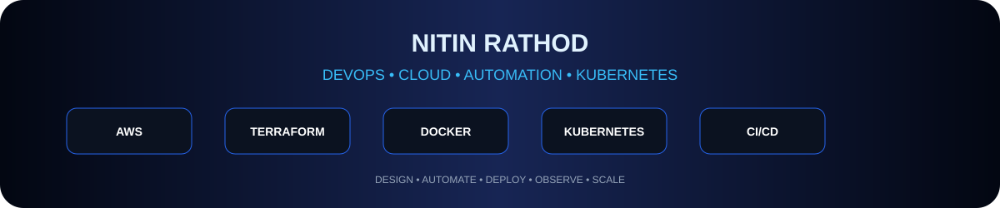
</div>

<div align="center"></div>
<p align="center">  </p>

<div align="center">
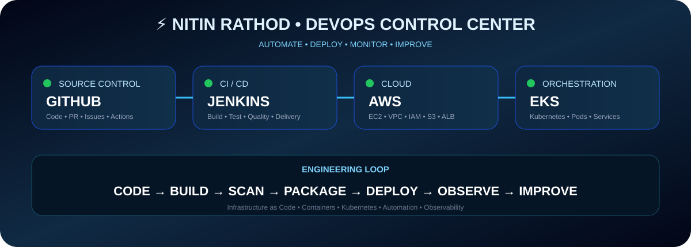

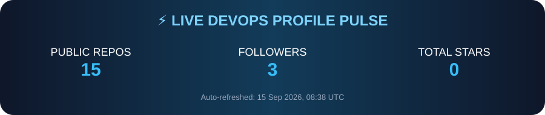
</div>

---

<div align="center"><h1>👨‍💻 Cloud & DevOps</h1><p><b>Cloud Infrastructure • CI/CD • Containers • Kubernetes • Infrastructure as Code • Automation</b></p></div>
> **Automate what can be automated. Version what can be versioned. Monitor what can fail. Improve everything.**

## 🧰 Tech Stack
<div align="center"></div>
<div align="center"><sub>☁️ Cloud • ⚙️ CI/CD • 🐳 Containers • ☸️ Orchestration • 🏗️ IaC • 🛡️ Security • 📊 Observability • 🤖 Automation</sub></div>

---

## 🏗️ 3-Tier Application Architecture
<div align="center"></div>

### 🔍 How It Works — Request to Response
<div align="center"></div>

**01 · Request** → User sends an HTTPS request.

**02 · Edge** → DNS / ALB / Ingress securely receives and routes traffic.

**03 · Presentation** → Frontend serves the UI and sends API requests.

**04 · Application** → Kubernetes-managed backend authenticates requests and executes business logic.

**05 · Data** → Backend accesses the private database and persistent storage.

**06 · Response** → Database → Backend API → Frontend → User.

---

### 🔐 Why This Architecture?

| Concern | Design | Benefit |
|---|---|---|
| 🔐 Security | Public edge → private app → private data | Smaller attack surface |
| 📈 Scalability | Independent tier scaling | Handles changing workloads |
| 🟢 Availability | Multiple application replicas | Better fault tolerance |
| 🧩 Maintainability | Separate UI / API / data | Easier troubleshooting |
| 🚀 Deployment | Version tiers independently | Safer releases and rollback |
| 💾 Recovery | Persistent storage + backups | Better resilience |
| 📊 Observability | Health checks + logs + metrics | Faster diagnosis |

### 📈 What Happens When Traffic Increases?
<div align="center"></div>

When an HPA-based Kubernetes setup is configured, the application tier can add replicas as workload increases. The database needs its own capacity, caching, read-replica or managed-database strategy.

### 🩺 Failure Scenario
<div align="center"></div>

If one backend pod becomes unhealthy, health probes can remove it from service while healthy replicas continue handling traffic. Logs and metrics help identify the root cause.

### 🔄 Complete Engineering Lifecycle
<div align="center"></div>

```text
CODE → GITHUB → CI VALIDATION → BUILD IMAGE → REGISTRY → KUBERNETES → HEALTH CHECKS → LOGS/METRICS → ALERT → INVESTIGATE → FIX → TEST → DEPLOY
```

### 🛡️ Security Flow
<div align="center"></div>

**🌍 Public Internet → ALB / Ingress → Frontend → Private Backend → Private Database**

> 🚫 The database is not publicly exposed.

### 📊 Scaling Strategy

| Layer | Scaling Strategy | Main Goal |
|---|---|---|
| 🌐 Presentation | Load balancing + replicas / CDN | Handle user traffic |
| ⚙️ Application | Kubernetes replicas + HPA | Handle API workload |
| 🗄️ Data | Managed DB + replicas / cache + backups | Reliability & persistence |

---

## ☸️ Kubernetes Operations Center
<div align="center"></div>

**Deploy → Probe → Observe → Scale → Rollout → Rollback**

The operations model covers Deployments, Pods, Services, Ingress, HPA, ConfigMaps, Secrets, health probes, rolling updates and self-healing behavior.

## ☁️ AWS Infrastructure Center
<div align="center"></div>

**Route 53 → ALB → VPC → EKS / Compute → Private Data**, with IAM, security groups, network boundaries, encryption, backups and monitoring around the infrastructure.

## 🛡️ DevSecOps Security Center
<div align="center"></div>

**Code Scan → Dependency Scan → Secret Scan → Container Scan → Secure Deploy**

Security is treated as a pipeline quality gate instead of a final manual check.

## 📊 Observability Center
<div align="center"></div>

**Observe → Detect → Investigate → Respond** using system health, CPU, memory, request rate, latency, error rate, pod health, logs and alerts.

## 🚨 Incident Response Center
<div align="center"></div>

**Alert → Investigate → Root Cause → Fix/Test → Recover → Prevent → Automate → Monitor → Improve**

---

## 🏗️ Enterprise Architecture
<div align="center">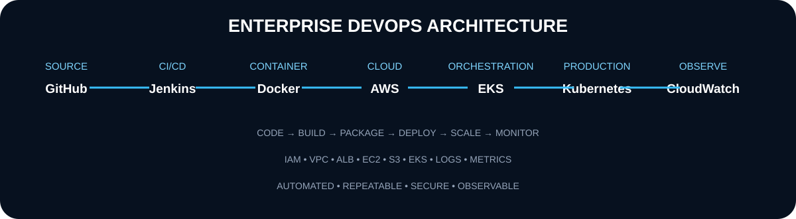</div>

## 🔄 End-to-End CI/CD
<div align="center">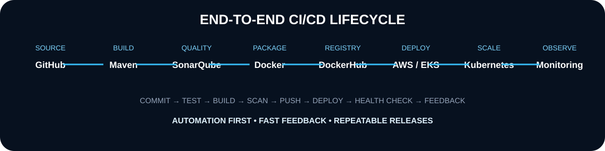</div>

## ☁️ AWS Cloud Architecture
<div align="center">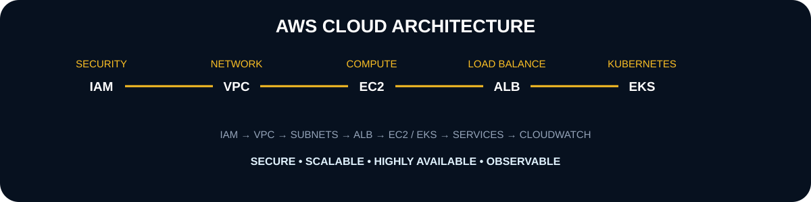</div>

## ☸️ Kubernetes Production Lifecycle
<div align="center">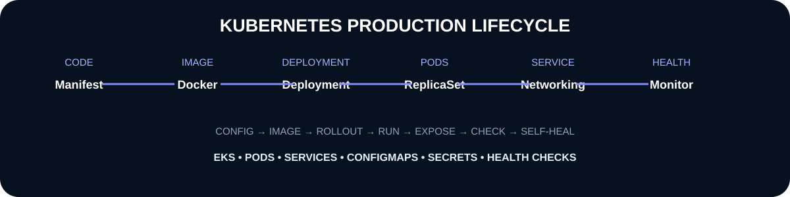</div>

## 🚀 Project Portfolio
<div align="center">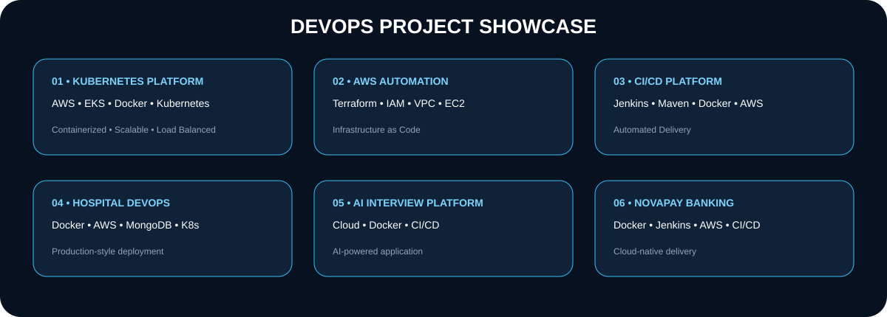</div>

## 🧠 Problem-Solving Lifecycle
<div align="center">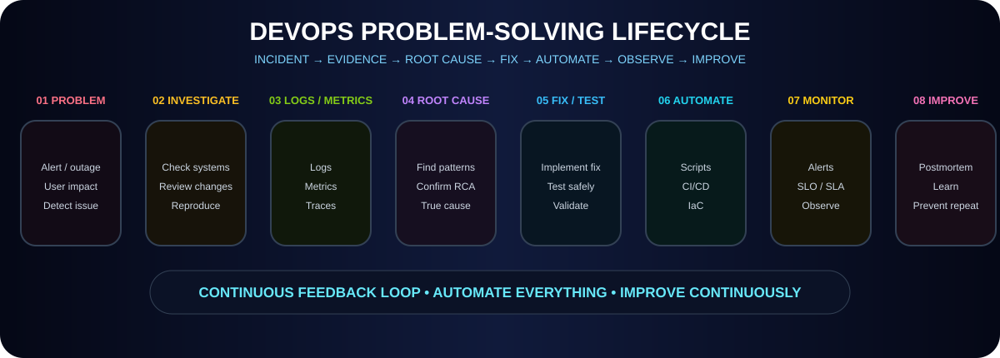</div>

## 🛡️ DevSecOps Roadmap
<div align="center">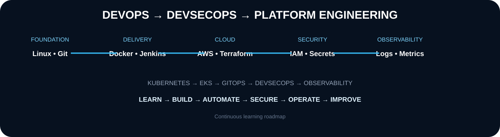</div>

---

## 🎯 Engineering Outcome
<div align="center"><b>CODE → SECURE → BUILD → DEPLOY → SCALE → OBSERVE → RESPOND → IMPROVE</b></div>

> **Architecture note:** These sections describe a deployment-ready target design. They do not claim that a live AWS/EKS production environment is currently connected.

## 📈 GitHub Analytics
<div align="center"> </div>
<div align="center"></div>

## 🏆 GitHub Trophy Wall
<div align="center"></div>

## 📊 Live Profile Automation
<div align="center">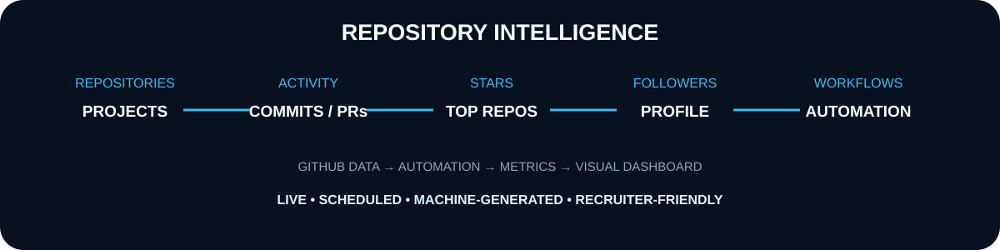</div>

---

## 📌 Engineering Principles
<div align="center"><b>AUTOMATION FIRST</b> • <b>INFRASTRUCTURE AS CODE</b> • <b>SECURITY BY DESIGN</b> • <b>OBSERVABILITY</b> • <b>RELIABILITY</b> • <b>CONTINUOUS IMPROVEMENT</b></div>

## 📫 Connect
<div align="center"><a href="mailto:nitindrathod4@gmail.com"></a> <a href="https://github.com/nitindrathod4-alt"></a></div>
<div align="center"><h3>⚡ LEARN • BUILD • AUTOMATE • DEPLOY • SCALE ⚡</h3></div>

---
<div align="center"></div>
