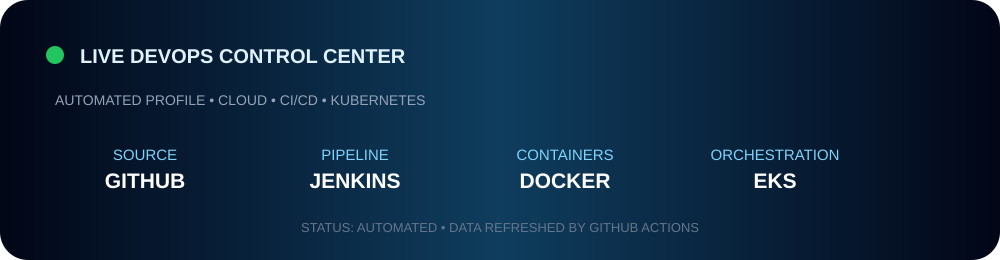

<div align="center">
  
</div>

<div align="center">
  
</div>

<p align="center">
  
  
  
  
</p>

<div align="center">
  
</div>

<div align="center">
  
</div>

---

# 👨‍💻 Nitin Rathod

<div align="center">
  <h2>DevOps & Cloud Engineer</h2>
  <p><b>Cloud Infrastructure • CI/CD • Containers • Kubernetes • Infrastructure as Code • Automation</b></p>
</div>

## 🚀 Professional Profile

I am a **DevOps & Cloud Engineer** focused on building reliable, automated and scalable infrastructure. I work across cloud infrastructure, containerization, CI/CD, Infrastructure as Code, Kubernetes and cloud-native operations.

I enjoy turning **source code into reliable production systems** through automation, repeatability, security and observability.

### 💡 Engineering Philosophy

> **Automate what can be automated. Version what can be versioned. Monitor what can fail. Improve everything.**

---

## ⚡ Core Expertise

<div align="center">

| ☁️ Cloud | 🔄 Automation | ☸️ Containers | 🏗️ Infrastructure |
|---|---|---|---|
| AWS | Jenkins | Docker | Terraform |
| EC2 | CI/CD | Kubernetes | IAM |
| VPC | GitHub | Amazon EKS | S3 |
| ALB | Maven | DockerHub | CloudWatch |

</div>

---

## 🧰 Complete Tech Stack

<p align="center"></p>

**Cloud:** AWS • EC2 • VPC • IAM • S3 • ALB • EKS • CloudWatch  
**Containers:** Docker • DockerHub • Kubernetes • Amazon EKS  
**IaC:** Terraform • AWS Provider • IAM Roles • VPC • EC2 • EKS  
**CI/CD:** Jenkins • GitHub • Git • Maven • Bash  
**Development:** Java • Spring Boot • Node.js • React • MongoDB • REST APIs  
**Operations:** Linux • Ubuntu • SSH • Networking • Logs • Troubleshooting

---

## 🔄 Live Automation Layer

This profile is not intended to be a static page. GitHub Actions periodically regenerates the live dashboard from GitHub API data, while the README surfaces live badges, analytics and activity widgets.

**Automation workflow:** `Profile Pulse`  
**Refresh:** scheduled + manual dispatch  
**Live data:** public repositories • followers • total stars • workflow status

[](../../actions/workflows/profile-pulse.yml)

---

## 🏗️ Enterprise DevOps Architecture

```text
Developer → GitHub → Jenkins → Build → Quality → Docker → Registry
                                      │                         │
                                      └──────────────┬──────────┘
                                                     ▼
                                                  AWS Cloud
                                                     │
                                      ┌──────────────┴──────────────┐
                                      ▼                             ▼
                                     EC2                           EKS
                                      │                             │
                                      │                       Kubernetes
                                      │                             │
                                      └──────────────┬──────────────┘
                                                     ▼
                                                Production
                                                     │
                                                     ▼
                                               Monitoring
```

---

## ☁️ AWS Architecture

```text
AWS CLOUD → IAM + VPC + S3 → Public / Private Subnets
                                      │
                         ┌────────────┴────────────┐
                         ▼                         ▼
                        ALB                       EC2
                                                   │
                                                   ▼
                                                  EKS
                                                   │
                                              Kubernetes
                                                   │
                                              CloudWatch
```

---

## 🔄 End-to-End CI/CD

```text
SOURCE → GITHUB → JENKINS → MAVEN → SONARQUBE → DOCKER
                                              ↓
                                         DOCKERHUB
                                              ↓
                                        AWS / EKS
                                              ↓
                                      KUBERNETES
                                              ↓
                                          DEPLOY
                                              ↓
                                        MONITOR
```

---

## ☸️ Kubernetes Production Concepts

| Concept | Focus |
|---|---|
| Pods | Application workloads |
| Deployments | Rollouts and replicas |
| Services | Application networking |
| ConfigMaps | Configuration |
| Secrets | Sensitive values |
| Namespaces | Resource isolation |
| EKS | Managed Kubernetes |
| LoadBalancer | External access |
| Health Checks | Reliability |
| Troubleshooting | CrashLoopBackOff / ImagePullBackOff |

---

## 🚀 Featured DevOps Projects

### ☸️ 01 — Cloud-Native Kubernetes Platform
**AWS • EKS • Kubernetes • Docker • LoadBalancer**  
Containerized workloads deployed through Kubernetes on AWS.

### 🏗️ 02 — AWS Infrastructure Automation
**Terraform • AWS • IAM • VPC • EC2 • EKS**  
Repeatable cloud infrastructure using Infrastructure as Code.

### 🔄 03 — Automated CI/CD Platform
**Jenkins • GitHub • Maven • Docker • DockerHub • AWS**  
Automated build, quality, containerization and delivery workflow.

### 🏥 04 — Hospital DevOps Platform
**Docker • AWS • MongoDB • Kubernetes**  
Full-stack cloud deployment with containerized services.

### 🤖 05 — AI Interview Platform
**Docker • AWS • CI/CD • Cloud**  
Cloud-oriented application deployment and automation.

### 💳 06 — NovaPay Banking Platform
**Docker • Jenkins • AWS • CI/CD**  
Automated application delivery and cloud deployment practices.

---

## 🧠 DevOps Problem-Solving

```text
PROBLEM → INVESTIGATE → LOGS / METRICS → ROOT CAUSE
                                      ↓
                                  FIX / TEST
                                      ↓
                                  AUTOMATE
                                      ↓
                                  MONITOR
                                      ↓
                                  IMPROVE
```

---

## 🔐 DevSecOps

🔑 IAM & least privilege • 🔒 Secrets • 🔍 Code Quality • 🐳 Container Security • ☸️ Kubernetes Security • 🛡️ Cloud Security • 📋 Quality Gates

---

## 📊 GitHub Analytics

<div align="center">


</div>

<div align="center">

</div>

---

## 🏆 GitHub Trophy Wall

<div align="center"></div>

---

## 📈 Contribution Activity

<div align="center"></div>

---

## 🗺️ DevOps Roadmap

```text
LINUX → GIT → DOCKER → JENKINS → AWS → TERRAFORM
                                      ↓
                                KUBERNETES → EKS
                                      ↓
                                DEVSECOPS
                                      ↓
                             OBSERVABILITY
                                      ↓
                           CLOUD ARCHITECTURE
```

---

## 🎯 Current Goals

- [x] Git & GitHub
- [x] Linux
- [x] Docker
- [x] AWS Fundamentals
- [x] Jenkins / CI/CD
- [x] Kubernetes Fundamentals
- [x] Terraform Fundamentals
- [ ] Advanced Kubernetes
- [ ] Advanced Terraform
- [ ] DevSecOps
- [ ] Cloud Architecture
- [ ] Observability
- [ ] Platform Engineering
- [ ] Open Source Contributions

---

## 🧪 Troubleshooting Checklist

```text
☑ Pod Status → ☑ Logs → ☑ Describe → ☑ Image
☑ Environment → ☑ Networking → ☑ IAM → ☑ Security
☑ Services → ☑ Endpoints → ☑ Deployment → ☑ Root Cause
☑ Fix → ☑ Test → ☑ Monitor → ☑ Document
```

---

## 📡 Dynamic Profile Stack

| Layer | Dynamic Element |
|---|---|
| 🟢 Status | GitHub Actions workflow status |
| 📊 Analytics | GitHub Stats / Streak / Languages |
| 🏆 Activity | Trophy + contribution graph |
| 📈 Metrics | Profile views / followers / stars |
| ⚙️ Automation | Scheduled Profile Pulse workflow |
| 🖼️ Dashboard | Generated SVG control center |
| 🔄 Refresh | Automated + manual workflow dispatch |

---

## 🧩 Areas I'm Exploring

| Area | Focus |
|---|---|
| ☁️ Cloud Architecture | Scalable AWS systems |
| ☸️ Kubernetes | Production workloads |
| 🔐 DevSecOps | Security in delivery |
| 🔄 GitOps | Declarative delivery |
| 📊 Observability | Metrics, logs and traces |
| ⚙️ Automation | Reduce manual work |
| 🚀 Platform Engineering | Developer-focused infrastructure |
| 🌐 Cloud Networking | Secure connectivity |

---

## 📌 Engineering Principles

**Automation First** • **Infrastructure as Code** • **Security by Design** • **Observability** • **Repeatability** • **Reliability** • **Continuous Improvement**

---

## 📫 Connect

<div align="center">
<a href="mailto:nitindrathod4@gmail.com"></a>
<a href="https://github.com/nitindrathod4-alt"></a>
</div>

<br>

<div align="center">
<h3>⚡ LEARN • BUILD • AUTOMATE • DEPLOY • SCALE ⚡</h3>
</div>

---

<div align="center">
  
  <br><br>
  <b>👨‍💻 Nitin Rathod | DevOps & Cloud Engineer</b>
</div>
