<div align="center">
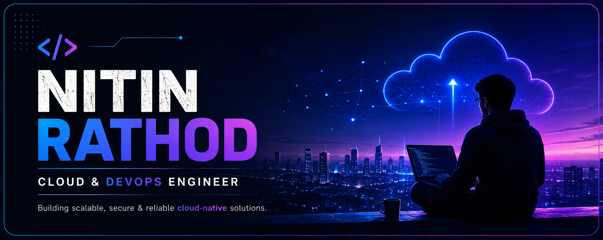
</div>

<div align="center"></div>
<p align="center">  </p>

## 🎛️ DevOps Engineering Dashboard
<div align="center">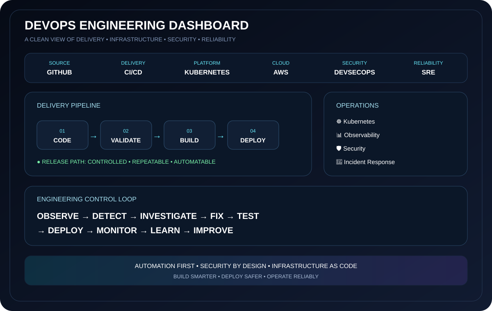</div>

> **Automate what can be automated. Version what can be versioned. Monitor what can fail. Improve everything.**

## 🧰 Engineering Stack
<div align="center"></div>

---

## 🏗️ 3-Tier Application — How It Works
<div align="center">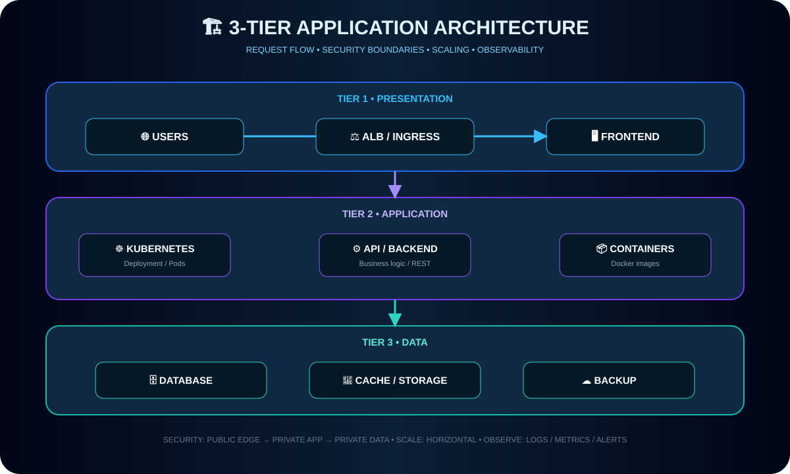</div>

### 🔍 Request → Response
<div align="center">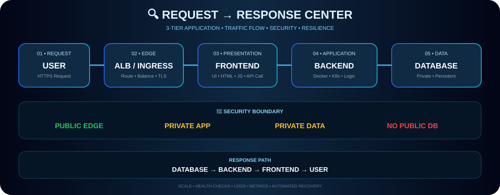</div>

`USER → HTTPS → DNS / ALB / INGRESS → FRONTEND → BACKEND → PRIVATE DATABASE → RESPONSE`

**Security boundary:** Public edge → presentation → private application → private data.

### 📈 Scale & Failure Behavior
- **Traffic spike:** load balancing + application replicas/HPA can distribute workload.
- **Pod failure:** unhealthy replicas can be removed from service while healthy replicas continue serving traffic.
- **Data layer:** database capacity, replicas, cache and backups require an independent strategy.

---

## 🚀 Delivery Center
<div align="center">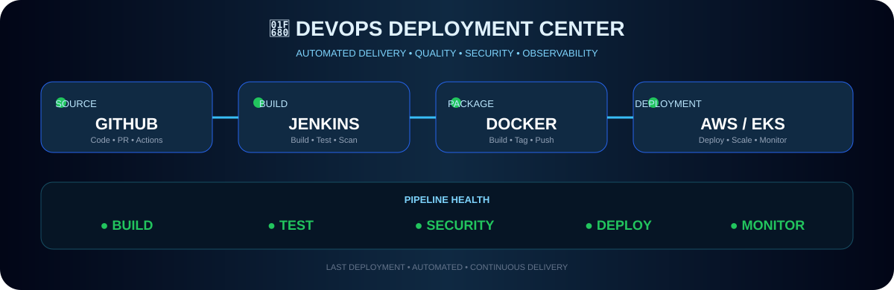</div>

`CODE → CI → QUALITY → SECURITY → IMAGE → REGISTRY → KUBERNETES → HEALTH → OBSERVE → RELEASE`

## ☸️ Kubernetes Operations
<div align="center">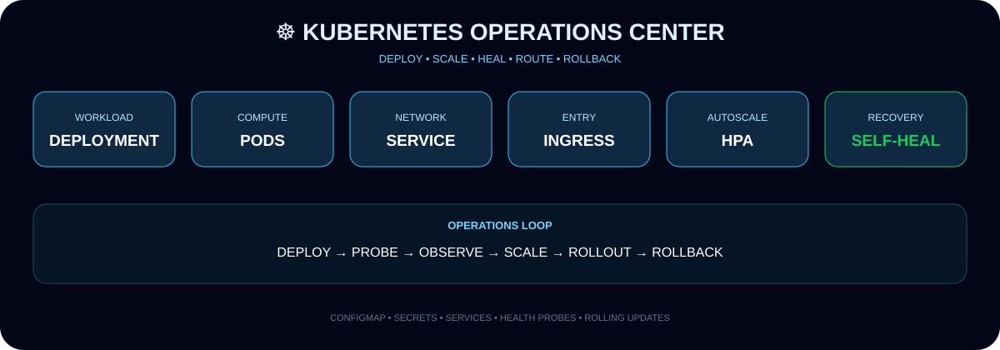</div>

**Deploy → Probe → Observe → Scale → Rollout → Rollback**

## ☁️ AWS Infrastructure
<div align="center">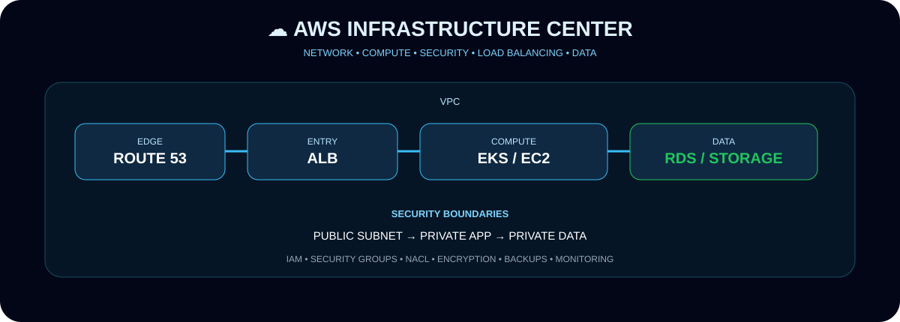</div>

**Route 53 → ALB → VPC → Compute/EKS → Private Data**, with IAM, network boundaries, encryption, backups and monitoring.

## 🛡️ DevSecOps
<div align="center">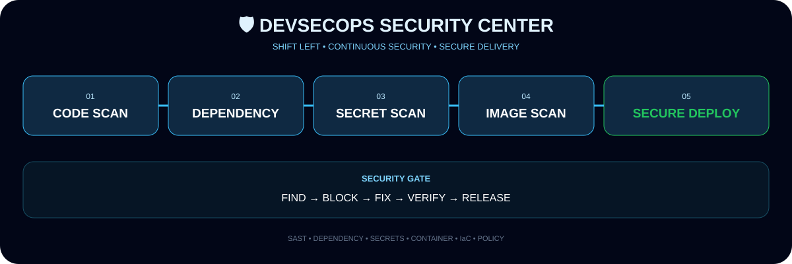</div>

**Code Scan → Dependency Scan → Secret Scan → Container Scan → Secure Deploy**

## 📊 Observability
<div align="center">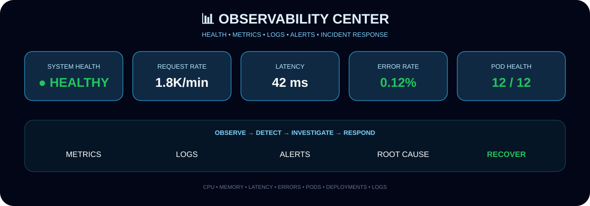</div>

**Metrics • Logs • Health • Latency • Errors • Alerts → Detect → Investigate → Respond**

## 🚨 Incident Response
<div align="center">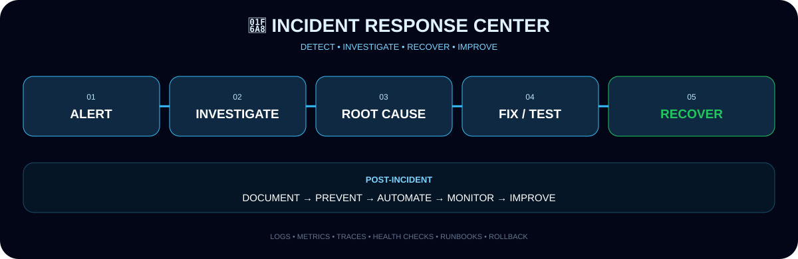</div>

**Alert → Investigate → Root Cause → Fix → Test → Recover → Prevent → Automate → Monitor**

## 🧪 Troubleshooting Playbook
<div align="center">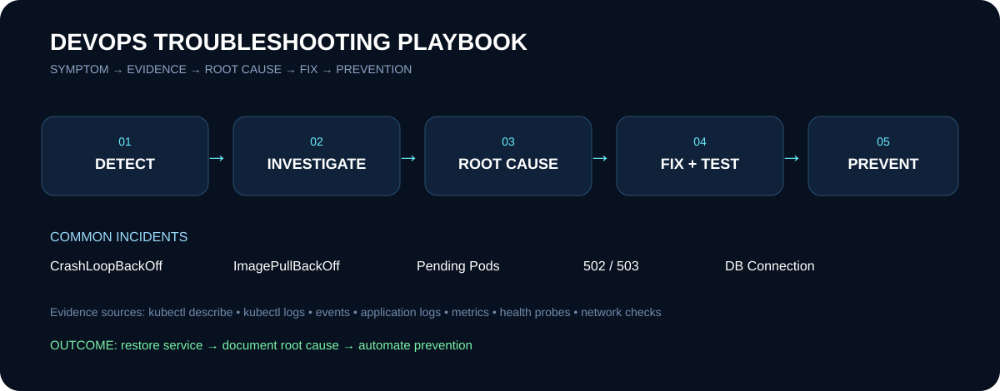</div>

| Incident | Evidence |
|---|---|
| `CrashLoopBackOff` | Pod events + logs + previous logs |
| `ImagePullBackOff` | Image/tag + registry access + events |
| `Pending Pod` | Scheduler events + resources + node conditions |
| `502 / 503` | Service endpoints + ingress + backend health |
| `DB Connection` | Config/secrets + network path + DB availability |
| `OOMKilled` | Memory limits + workload usage + metrics |

## 🧱 Infrastructure as Code
```text
Terraform → fmt → validate → plan → review → apply → AWS → drift check
```

## 🔄 Deployment Strategies
| Strategy | Use case | Rollback |
|---|---|---|
| Rolling | Standard continuous releases | Previous revision |
| Blue/Green | Fast environment switch | Traffic switch |
| Canary | Small controlled traffic | Stop canary |

## 🧠 SRE & Reliability
<div align="center">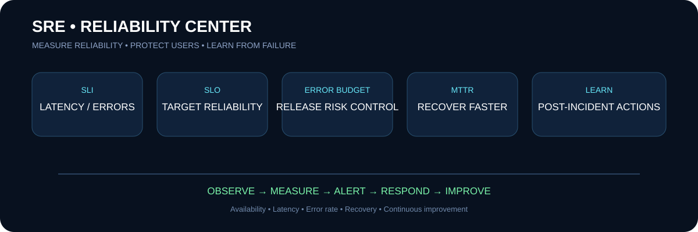</div>

**SLI → SLO → Error Budget → MTTR → Post-Incident Improvement**

---

## 📊 GitHub Analytics
<div align="center"> </div>
<div align="center"></div>

## 🏆 GitHub Trophy Wall
<div align="center"></div>

---

## 🎯 Engineering Model
<div align="center"><b>CODE → SECURE → BUILD → DEPLOY → SCALE → OBSERVE → RESPOND → IMPROVE</b></div>

> **Architecture note:** The diagrams document a deployment-ready engineering model; they do not claim that a live AWS/EKS production environment is currently connected.

## 📫 Connect
<div align="center"><a href="mailto:nitindrathod4@gmail.com"></a> <a href="https://github.com/nitindrathod4-alt"></a></div>

<div align="center"><h3>⚡ BUILD • AUTOMATE • DEPLOY • SCALE ⚡</h3></div>
